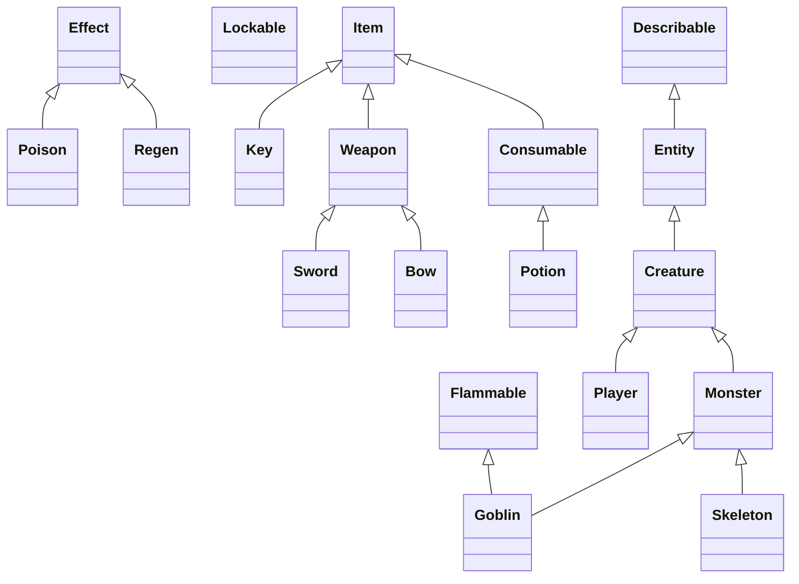

```mermaid
classDiagram
    direction TB

    class Describable
    class Flammable
    class Lockable

    Effect <|-- Poison
    Effect <|-- Regen

    Item <|-- Key
    Item <|-- Weapon
    Item <|-- Consumable
    Weapon <|-- Sword
    Weapon <|-- Bow
    Consumable <|-- Potion

    Describable <|-- Entity
    Entity <|-- Creature
    Creature <|-- Player
    Creature <|-- Monster
    Monster <|-- Goblin
    Flammable <|-- Goblin
    Monster <|-- Skeleton
```