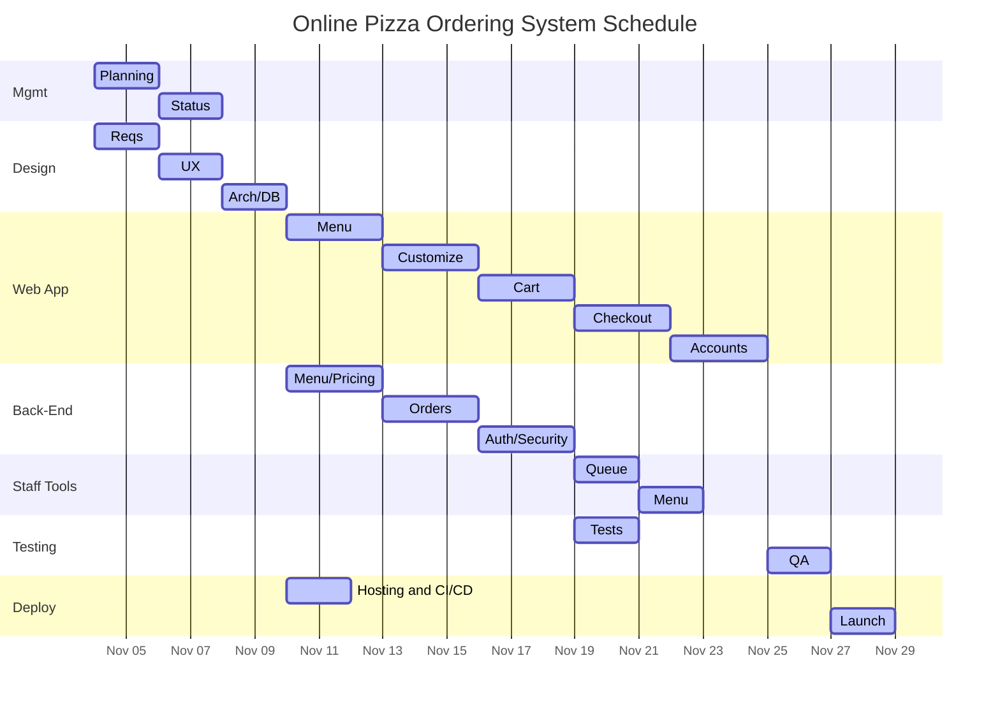

```mermaid
gantt
    title Online Pizza Ordering System Schedule
    dateFormat YYYY-MM-DD
    axisFormat %b %d
    section Mgmt
    Planning          :active, pm1, 2026-11-04, 2d
    Status            :active, pm2, after pm1, 2d
    section Design
    Reqs              :active, rd1, 2026-11-04, 2d
    UX                :active, rd2, after rd1, 2d
    Arch/DB           :active, rd3, after rd2, 2d
    section Web App
    Menu              :active, web1, after pm2 rd3, 3d
    Customize         :active, web2, after web1, 3d
    Cart              :active, web3, after web2, 3d
    Checkout          :active, web4, after web3, 3d
    Accounts          :active, web5, after web4, 3d
    section Back-End
    Menu/Pricing      :active, be1, after pm2 rd3, 3d
    Orders            :active, be2, after be1, 3d
    Auth/Security     :active, be3, after be2, 3d
    section Staff Tools
    Queue             :active, st1, after be3, 2d
    Menu              :active, st2, after st1, 2d
    section Testing
    Tests             :active, t1, after be3, 2d
    QA                :active, t2, after web5 st2, 2d
    section Deploy
    Hosting and CI/CD             :active, d1, after rd3, 2d
    Launch            :active, d2, after t2 d1, 2d
```